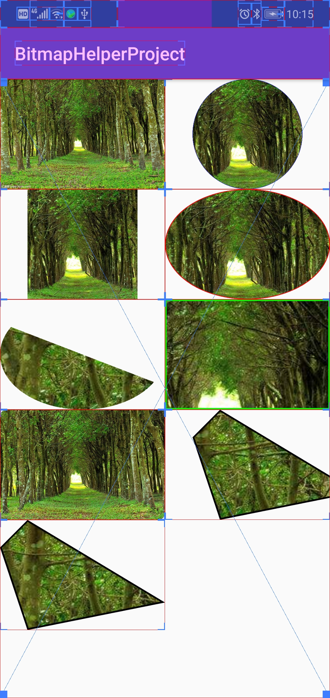
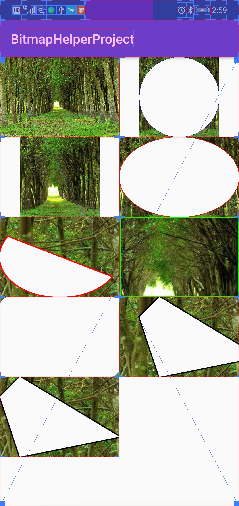

 在新版本中提供了自定义功能，优化了项目框架。
 由于许多时候需要使用到对图片的一些裁剪特效，所以写了一个简单的帮助库，目前只是简单对形状做了一些处理，后续会进行优化改进，加入更多的效果。
## 一.各种处理效果



第一张图片是原图，后续两张依次是裁剪圆形、正方形、椭圆、弧形、矩形、圆角矩形、随意路径不进行偏移处理，随意路径进行偏移处理的正常与反向效果，既可以从源图片中央开始裁剪，指定裁剪比例，也可以在源图片指定任意的矩形位置开始裁剪，并且可以指定是否添加边框，边框颜色和宽度。
## 二.添加依赖
在project的build.gradle文件中添加

```
allprojects {
		repositories {
			...
			maven { url 'https://jitpack.io' }
		}
	}
```
在module的build.gradle文件中添加

```
dependencies {
	        implementation 'com.github.MingYueChunQiu:BitmapHelper:0.1.4'
	}
```

## 三.Bitmap的使用
```
    //先获取对图片形状处理的帮助类
    BitmapShapeHelper helper = BitmapHelperFactory.newBitmapShapeHelper();
    
    //在BitmapShapeHelper 里目前提供了对7种形状的处理
	@NonNull
    public BitmapCircleShapeHelper getBitmapCircleShapeHelper() {
        return new BitmapCircleShapeHelper();
    }

    @NonNull
    public BitmapCircleShapeHelper getBitmapCircleShapeHelper(BitmapCircleShapeable shapeable) {
        return new BitmapCircleShapeHelper(shapeable);
    }

    @NonNull
    public BitmapSquareShapeHelper getBitmapSquareShapeHelper() {
        return new BitmapSquareShapeHelper();
    }

    @NonNull
    public BitmapSquareShapeHelper getBitmapSquareShapeHelper(BitmapSquareShapeable shapeable) {
        return new BitmapSquareShapeHelper(shapeable);
    }

    @NonNull
    public BitmapRoundRectShapeHelper getBitmapRoundRectShapeHelper() {
        return new BitmapRoundRectShapeHelper();
    }

    @NonNull
    public BitmapRoundRectShapeHelper getBitmapRoundRectShapeHelper(BitmapRoundRectShapeable shapeable) {
        return new BitmapRoundRectShapeHelper(shapeable);
    }

    @NonNull
    public BitmapPathShapeHelper getBitmapPathShapeHelper() {
        return new BitmapPathShapeHelper();
    }

    @NonNull
    public BitmapPathShapeHelper getBitmapPathShapeHelper(BitmapPathShapeable shapeable) {
        return new BitmapPathShapeHelper(shapeable);
    }

    @NonNull
    public BitmapArcShapeHelper getBitmapArcShapeHelper() {
        return new BitmapArcShapeHelper();
    }

    @NonNull
    public BitmapArcShapeHelper getBitmapArcShapeHelper(BitmapArcShapeable shapeable) {
        return new BitmapArcShapeHelper(shapeable);
    }

    @NonNull
    public BitmapRectShapeHelper getBitmapRectShapeHelper() {
        return new BitmapRectShapeHelper();
    }

    @NonNull
    public BitmapRectShapeHelper getBitmapRectShapeHelper(BitmapRectShapeable shapeable) {
        return new BitmapRectShapeHelper(shapeable);
    }

    @NonNull
    public BitmapOvalShapeHelper getBitmapOvalShapeHelper() {
        return new BitmapOvalShapeHelper();
    }

    @NonNull
    public BitmapOvalShapeHelper getBitmapOvalShapeHelper(BitmapOvalShapeable shapeable) {
        return new BitmapOvalShapeHelper(shapeable);
    }
```
更多详细内容请至本文末尾项目地址看项目demo使用或库源码。
## 四.结语
项目的GitHub地址是[https://github.com/MingYueChunQiu/BitmapHelper](https://github.com/MingYueChunQiu/BitmapHelper)，码云的项目地址是[https://gitee.com/MingYueChunQiu/BitmapHelper](https://gitee.com/MingYueChunQiu/BitmapHelper)。如果有什么不足或建议，欢迎反馈。
